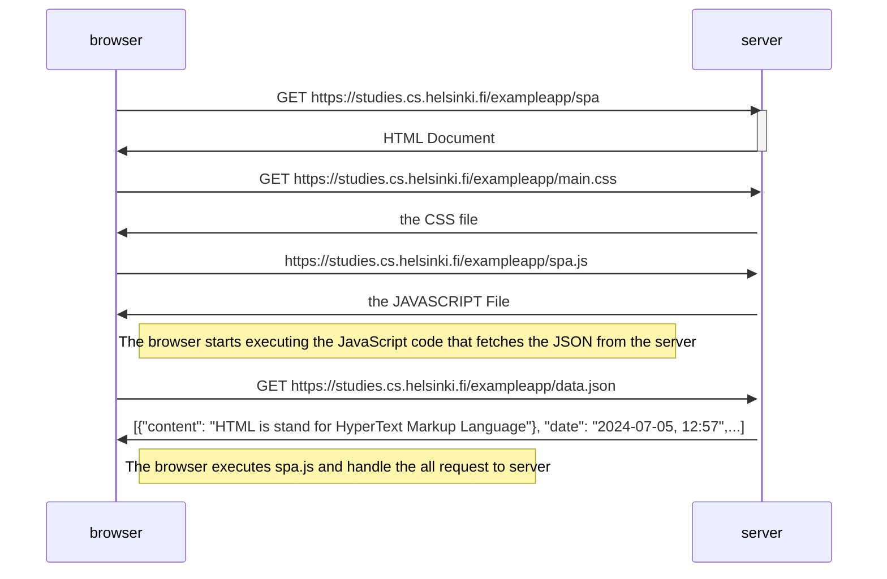

```mermaid

sequenceDiagram
    participant browser
    participant server

    browser->>server: GET https://studies.cs.helsinki.fi/exampleapp/spa
    activate server
    server->>browser: HTML Document
    deactivate server

    browser->> server: GET https://studies.cs.helsinki.fi/exampleapp/main.css
    activate server
    server->>browser: the CSS file

    browser->>server:  https://studies.cs.helsinki.fi/exampleapp/spa.js
    activate server
    server->> browser: the JAVASCRIPT File
    Note right of browser: The browser starts executing the JavaScript code that fetches the JSON from the server

    browser->>server: GET https://studies.cs.helsinki.fi/exampleapp/data.json
    activate server
    server->> browser: [{"content": "HTML is stand for HyperText Markup Language"}, "date": "2024-07-05, 12:57",...]
    Note right of browser: The browser executes spa.js and handle the all request to server 
    
```