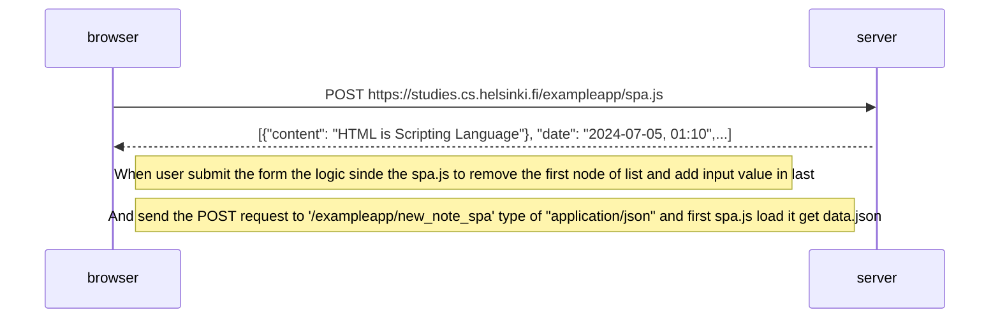

```mermaid

sequenceDiagram
    participant browser
    participant server

    
    browser->>server: POST https://studies.cs.helsinki.fi/exampleapp/spa.js
    activate server
    server-->> browser: [{"content": "HTML is Scripting Language"}, "date": "2024-07-05, 01:10",...]
    Note right of browser: When user submit the form the logic sinde the spa.js to remove the first node of list and add input value in last
    Note right of browser: And send the POST request to '/exampleapp/new_note_spa' type of "application/json" and first spa.js load it get data.json


```